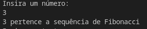
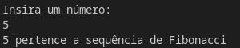
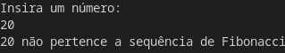
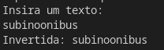
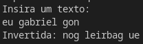

# Aplicação criada em C#, Dotnet Versão 8.

Para iniciar a aplicação certifique-se de tê-lo instalado

No terminal, navegue até a pasta "Processo-Seletivo" e digite "dotnet run".

# Respostas
1) Observe o trecho de código abaixo:

int INDICE = 13, SOMA = 0, K = 0;

enquanto K < INDICE faça

{

K = K + 1;

SOMA = SOMA + K;

}

imprimir(SOMA);

Ao final do processamento, qual será o valor da variável SOMA?
91

2) Dado a sequência de Fibonacci, onde se inicia por 0 e 1 e o próximo valor sempre será a soma dos 2 valores anteriores (exemplo: 0, 1, 1, 2, 3, 5, 8, 13, 21, 34...), escreva um programa na linguagem que desejar onde, informado um número, ele calcule a sequência de Fibonacci e retorne uma mensagem avisando se o número informado pertence ou não a sequência.

IMPORTANTE:

Esse número pode ser informado através de qualquer entrada de sua preferência ou pode ser previamente definido no código;

---

---

---

3) Descubra a lógica e complete o próximo elemento:

a) 1, 3, 5, 7, _9__

b) 2, 4, 8, 16, 32, 64, __128___

c) 0, 1, 4, 9, 16, 25, 36, __49___

d) 4, 16, 36, 64, __100___

e) 1, 1, 2, 3, 5, 8, __13___

f) 2,10, 12, 16, 17, 18, 19, __20___

4) Você está em uma sala com três interruptores, cada um conectado a uma lâmpada em uma sala diferente. Você não pode ver as lâmpadas da sala em que está, mas pode ligar e desligar os interruptores quantas vezes quiser. Seu objetivo é descobrir qual interruptor controla qual lâmpada.

Como você faria para descobrir, usando apenas duas idas até uma das salas das lâmpadas, qual interruptor controla cada lâmpada?

Ligaria o primeiro interruptor por alguns minutos e depois desligaria, e ligaria o segundo, após isso iria até a sala um.
Se a lâmpada estiver acesa então o segundo interruptor está ligado a ela, se estiver apagada é necessário verificar a temperatura, uma vez que o interruptor ficou ligado por algum tempo, se o primeiro for o correto, então a lâmpada estará quente, caso não seja, então estará sem calor.
 

5) Escreva um programa que inverta os caracteres de um string.

IMPORTANTE:

a) Essa string pode ser informada através de qualquer entrada de sua preferência ou pode ser previamente definida no código;

b) Evite usar funções prontas, como, por exemplo, reverse;

---
